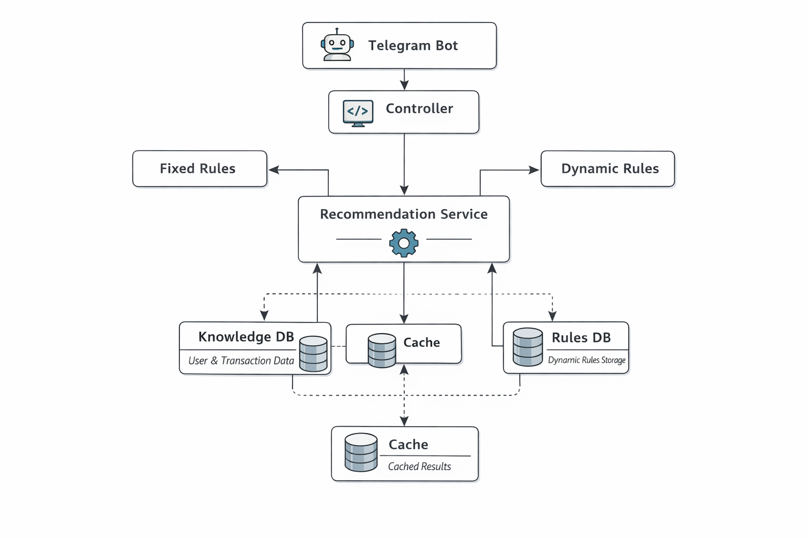

# Рекомендательная система для банка "Стар"

## Описание

Проект представляет собой систему рекомендаций для пользователей банка "Стар". Система рекомендует различные банковские продукты на основе набора фиксированных и динамических правил. Данные о пользователях, продуктах и транзакциях хранятся в базе данных H2.

---

## Что реализовано

### Stage 1
- Эндпоинт получения рекомендаций: `GET /recommendation/{userId}`
- Фиксированные правила рекомендаций (rule sets)
- Основная БД знаний (users / products / transactions)
- Работа с основной БД через `JdbcTemplate`

### Stage 2
- Динамические правила рекомендаций (CRUD через REST API)
- Отдельная rules DB (JPA + Liquibase)
- Rule Engine для исполнения условий (4 типа query)
- Поддержка `negate` и операторов сравнения
- Кеширование SQL-запросов knowledge DB через Caffeine
- Интеграция динамических правил в `/recommendation/{userId}` без breaking changes
- OpenAPI / Swagger UI
- Unit и Integration tests

### Stage 3
- Статистика динамических правил
- Management API (очистка кэшей, информация о сервисе)
- Telegram Bot (PoC)

---

## Архитектура системы

Система состоит из нескольких ключевых компонентов, которые взаимодействуют друг с другом для генерации и выдачи рекомендаций:

1. **Telegram Bot** — для взаимодействия с пользователями, принимает команду `/recommend <username>` и возвращает соответствующие рекомендации.
2. **Controller** — принимает HTTP-запросы и делегирует их обработку сервисам.
3. **Recommendation Service** — основной сервис для обработки рекомендаций, который использует как фиксированные, так и динамические правила.
4. **Fixed Rules** — заранее определенные и неизменяемые правила, проверяемые для каждого пользователя.
5. **Dynamic Rules** — динамически добавляемые правила, которые могут быть изменены через API.
6. **Cache** — кеширует результаты запросов для ускорения обработки часто запрашиваемых данных.
7. **Knowledge DB** — база данных, содержащая информацию о пользователях и их транзакциях.
8. **Rules DB** — база данных для хранения динамических правил и их модификации.

### Схема компонентов системы (кратко)



### Правила

**Fixed rules (Stage 1)**  
Реализованы через `RecommendationRuleSet` и остаются без изменений.

**Dynamic rules (Stage 2)**  
Хранятся в rules DB, загружаются и исполняются через `QueryEngine` и набор executor-ов.
Система легко расширяется за счет добавления новых типов query (см. раздел API - Типы query) и executor-ов, без необходимости править код сервиса.

---

## API

### Swagger / OpenAPI
- Swagger UI: `/swagger-ui/index.html`
- OpenAPI JSON: `/v3/api-docs`

---

## Эндпоинты

### Получение рекомендаций для пользователя

`GET /recommendation/<user_id>`

**Response:**

```json
{
  "user_id": "<user_id>",
  "recommendations": [
    {
      "name": "<имя продукта>",
      "id": "<id продукта>",
      "text": "<текстовое описание продукта>"
    }
  ]
}
```

### Создание нового динамического правила

`POST /rule`

**Request Body:**

```json
{
  "product_name": "Простой кредит",
  "product_id": "ab138afb-f3ba-4a93-b74f-0fcee86d447f",
  "product_text": "<текст рекомендации>",
  "rule": [
    {
      "query": "USER_OF",
      "arguments": ["CREDIT"],
      "negate": true
    },
    {
      "query": "TRANSACTION_SUM_COMPARE_DEPOSIT_WITHDRAW",
      "arguments": ["DEBIT", ">"],
      "negate": false
    },
    {
      "query": "TRANSACTION_SUM_COMPARE",
      "arguments": ["DEBIT", "DEPOSIT", ">", "100000"],
      "negate": false
    }
  ]
}
```

**Response:**

```json
{
  "id": "<сгенерированный id>",
  "product_name": "Простой кредит",
  "product_id": "ab138afb-f3ba-4a93-b74f-0fcee86d447f",
  "product_text": "<текст рекомендации>",
  "rule": [
    {
      "query": "USER_OF",
      "arguments": ["CREDIT"],
      "negate": true
    },
    {
      "query": "TRANSACTION_SUM_COMPARE_DEPOSIT_WITHDRAW",
      "arguments": ["DEBIT", ">"],
      "negate": false
    },
    {
      "query": "TRANSACTION_SUM_COMPARE",
      "arguments": ["DEBIT", "DEPOSIT", ">", "100000"],
      "negate": false
    }
  ]
}
```

### Статистика срабатывания правил

`GET /rule/stats`

**Response:**

```json
{
  "stats": [
    {
      "rule_id": "<id правила>",
      "count": "<число срабатываний этого правила>"
    }
  ]
}
```

### Очистка кеша

`POST /management/clear-caches`

**Описание:** Очистка всех кешированных данных.

### Информация о сервисе

`GET /management/info`

**Response:**

```json
{
  "name": "Рекомендательная система",
  "version": "1.0.0"
}
```

### Получить статистику по всем правилам 
`GET /rule/stats`

Поведение:
- Возвращает статистику **по всем** динамическим правилам, которые существуют в rules DB.
- Если по правилу ещё не было срабатываний, оно **всё равно присутствует** в списке со значением `count = 0`.
- `rule_id` — идентификатор правила (id из rules DB).
- `count` — количество срабатываний правила (инкрементируется каждый раз, когда правило выполнилось для пользователя и рекомендация была выдана).

Пример ответа:
```json
{
  "stats": [
    { "rule_id": "1", "count": "3" },
    { "rule_id": "2", "count": "0" }
  ]
}
```

### Очистка кешей 
`POST /management/clear-caches`

Поведение:
- Запрос **без тела** (ничего не принимается через `@RequestBody`).
- Очищаются **все** кеши рекомендаций (включая кеши репозитория knowledge DB).
- После вызова следующие запросы рекомендаций должны снова обращаться к БД (кеш прогреется заново).

Ответ (HTTP 200): пустое тело.

### Информация о сервисе 
`GET /management/info`

Поведение:
- Возвращает информацию о сервисе в формате:
  - `name` — название сервиса (artifactId)
  - `version` — версия из `pom.xml`
- Значения извлекаются динамически через build-info (Spring Boot BuildProperties).

Ответ (HTTP 200):
```json
{
  "name": "starbank-recommendation",
  "version": "1.0.0"
}
```

### Получить статистику по всем правилам 
`GET /rule/stats`

Поведение:
- Возвращает статистику **по всем** динамическим правилам, которые существуют в rules DB.
- Если по правилу ещё не было срабатываний, оно **всё равно присутствует** в списке со значением `count = 0`.
- `rule_id` — идентификатор правила (id из rules DB).
- `count` — количество срабатываний правила (инкрементируется каждый раз, когда правило выполнилось для пользователя и рекомендация была выдана).

Пример ответа:
```json
{
  "stats": [
    { "rule_id": "1", "count": "3" },
    { "rule_id": "2", "count": "0" }
  ]
}
```

### Очистка кешей 
`POST /management/clear-caches`

Поведение:
- Запрос **без тела** (ничего не принимается через `@RequestBody`).
- Очищаются **все** кеши рекомендаций (включая кеши репозитория knowledge DB).
- После вызова следующие запросы рекомендаций должны снова обращаться к БД (кеш прогреется заново).

Ответ (HTTP 200): пустое тело.

### Информация о сервисе 
`GET /management/info`

Поведение:
- Возвращает информацию о сервисе в формате:
  - `name` — название сервиса (artifactId)
  - `version` — версия из `pom.xml`
- Значения извлекаются динамически через build-info (Spring Boot BuildProperties).

Ответ (HTTP 200):
```json
{
  "name": "starbank-recommendation",
  "version": "1.0.0"
}
```

---

## Типы query (Stage 2)

### 1) USER_OF
Проверяет, что у пользователя есть хотя бы одна транзакция по продукту типа `productType`.

Формат:
```json
{ "query": "USER_OF", "arguments": ["DEBIT"], "negate": false }
```

---

### 2) ACTIVE_USER_OF
Активный пользователь продукта — количество транзакций по продукту >= 5.

Формат:
```json
{ "query": "ACTIVE_USER_OF", "arguments": ["DEBIT"], "negate": false }
```

---

### 3) TRANSACTION_SUM_COMPARE
Сравнивает сумму транзакций по продукту и типу транзакции с порогом.

Формат arguments:
```
[productType, transactionType, operator, amount]
```

Пример:
```json
{
  "query": "TRANSACTION_SUM_COMPARE",
  "arguments": ["DEBIT", "WITHDRAW", ">", "100000"],
  "negate": false
}
```

Поддерживаемые операторы:
```
>, <, =, >=, <=
```

---

### 4) TRANSACTION_SUM_COMPARE_DEPOSIT_WITHDRAW
Сравнивает суммы `DEPOSIT` и `WITHDRAW` по продукту.

Формат arguments:
```
[productType, operator]
```

Пример:
```json
{
  "query": "TRANSACTION_SUM_COMPARE_DEPOSIT_WITHDRAW",
  "arguments": ["SAVING", ">="],
  "negate": false
}
```

---

## Запуск проекта

1. Клонируйте репозиторий:
   ```
   git clone <repository_url>
   ```

2. Перейдите в папку проекта:
   ```
   cd <project_folder>
   ```

3. Настройте бота в файле application-local.yml:
   ```
   telegram:
     bot:
       token: "BOT_TOKEN_HERE"
       username: "BOT_USERNAME_HERE"
   ```

4. Запустите приложение:
   ```
   ./mvnw spring-boot:run
   ```

Теперь ваше приложение будет доступно на `http://localhost:8080`.

### Требования
- Java 17
- Maven

### Конфигурация БД

- `spring.datasource.*` — knowledge DB
- `spring.rules-datasource.*` — rules DB

Миграции rules DB выполняются через Liquibase:
`db/changelog/db.changelog-rules.yaml`.

### Telegram Bot

Команды:
- `/start` — приветствие и справка
- `/recommend <username>` — получение рекомендаций

Поведение:
- найден ровно один пользователь → выдаются рекомендации
- 0 или >1 пользователей → "Пользователь не найден"
- включена защита от DDoS-атак (1 команда в секунду, не более 20 команд в минуту, далее - игнорирование сообщений, настройка через application.yml)
- нечастое предупреждение пользователя о спаме сообщений (не чаще 1 сообщения в 10 секунд)

Конфигурация (без хранения токена в git):

```yaml
telegram:
  bot:
    token: ${TELEGRAM_BOT_TOKEN:}
    username: ${TELEGRAM_BOT_USERNAME:}
```

---

## Тесты

### Unit tests
```bash
mvn test
```

### Integration tests (Stage 2)
Используется профиль `test`, обе БД поднимаются в H2 in-memory.
```bash
mvn test -Dspring.profiles.active=test
```

---

## Примечания

- Денежные суммы хранятся и агрегируются как `long` в рублях (Stage 1)
- `negate = true` инвертирует результат условия на уровне `QueryEngine` (Stage 2)
- Кеширование запросов knowledge DB реализовано через Caffeine (Stage 2)
- Рекомендации кешируются (Stage 3)
- Кеш очищается через Management API (Stage 3)